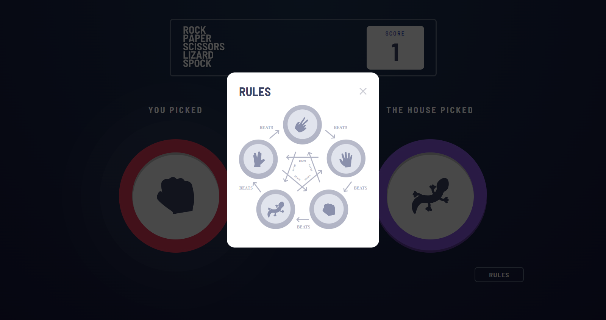

# Frontend Mentor - Rock, Paper, Scissors solution

This is a solution to the [Rock, Paper, Scissors challenge on Frontend Mentor](https://www.frontendmentor.io/challenges/rock-paper-scissors-game-pTgwgvgH). Frontend Mentor challenges help you improve your coding skills by building realistic projects. 

### The challenge

Users should be able to:

- View the optimal layout for the game depending on their device's screen size
- Play Rock, Paper, Scissors against the computer
- Maintain the state of the score after refreshing the browser _(optional)_
- **Bonus**: Play Rock, Paper, Scissors, Lizard, Spock against the computer _(optional)_

### Screenshot
I am delighted to share with you a screenshot of my solution to the rock-paper-scissors challenge. In developing this solution, my primary goal was to create a visually appealing and engaging user experience. Users can select their weapon of choice, and the computer will choose its weapon at random. The result is displayed in a clean and intuitive layout, with clear information about the user's score and the outcome of each round. I have also incorporated elements such as sound effects and animations to further enhance the overall user experience. Overall, I believe that my solution is a significant improvement over traditional rock-paper-scissors interfaces, and I look forward to hearing your thoughts and feedback.

### Links

- Live Site URL: [rock-paper-scissor](https://rock-paper-scissor-flame.vercel.app/)

### Built with

- Semantic HTML5 markup
- CSS custom properties
- SASS/SCSS
- [React](https://reactjs.org/) - JS library

## Author

- Website - [Jownsu](https://jownsu.github.io/)
- Frontend Mentor - [@jownsu](https://www.frontendmentor.io/profile/jownsu)
- Instagram - [jownsu](https://www.instagram.com/jownsu/)
- Linked In - [Jhones](https://www.linkedin.com/in/jhones-digno-866904213/)